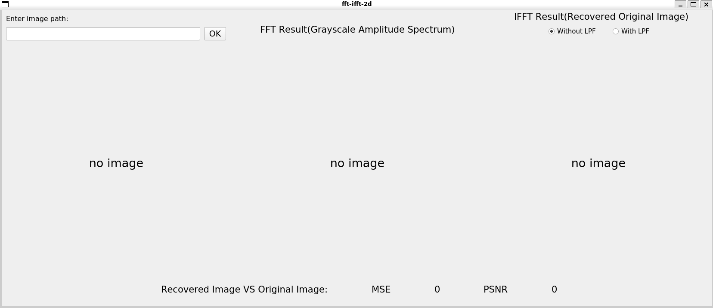
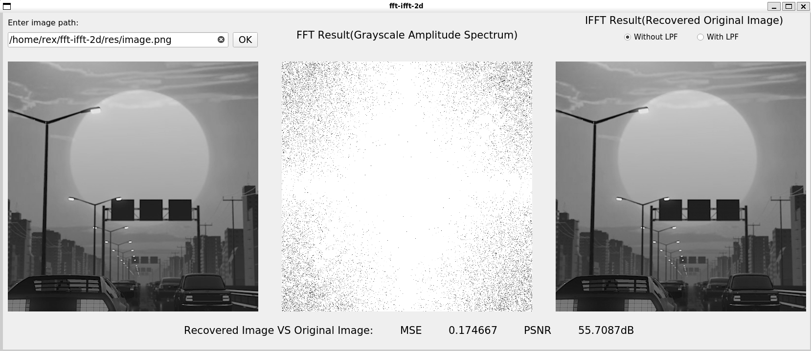
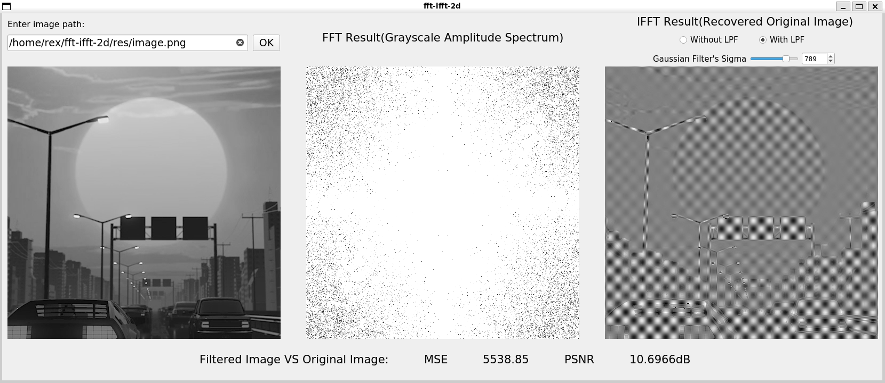
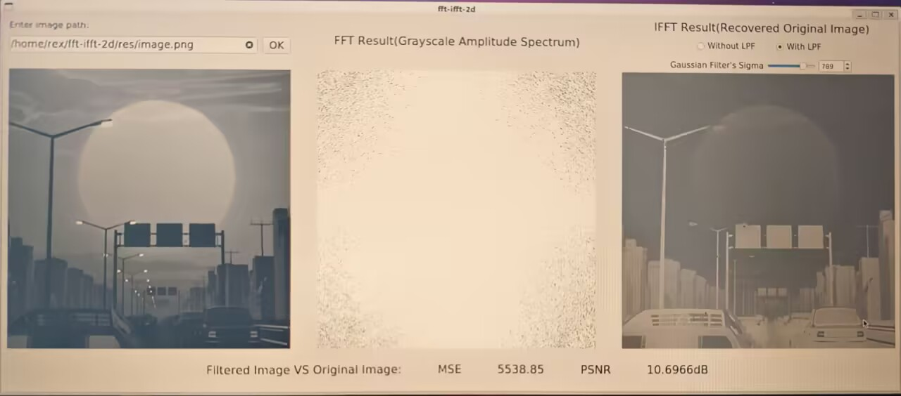

# 项目内容
1. 使用 C/C++编写代码，读取灰度图像。
2. 对图像进行 FFT 运算，生成频域复数矩阵并可视化。
3. 对频域数据直接进行 IFFT，重建原始图像，计算重建图像与原图的均
方误差（MSE）或峰值信噪比（PSNR），验证 FFT/IFFT 的可逆性。
4. 对频域数据进行低通滤波，再做 IFFT，比较滤波后图像与原图像的均
方误差（MSE）或峰值信噪比（PSNR）。

# 运行环境
Ubuntu 20.04 LTS操作系统，不适配Windows系统。

# 所需依赖
## OpenCV 4.11.0 版本
下载地址：<a href="https://opencv.org/releases/">https://opencv.org/releases/</a>

相近的版本就行，编译前需要自行修改`CMakeLists.txt`文件中的`OpenCV_DIR`变量，指向安装 OpenCV 路径。

## Qt 5.12.8 版本
这是Ubuntu 20.04 LTS系统默认安装的Qt版本，下载地址：
<a href="https://download.qt.io/archive/qt/">https://download.qt.io/archive/qt/</a>


# 编译方法
克隆项目源码到本地：
```bash
git clone https://github.com/RRRexyz/fft-ifft-2d
```

修改`CMakeLists.txt`文件中的相关配置，主要是
```cmake
set(OpenCV_DIR ${CMAKE_SOURCE_DIR}/dependencies/opencv-4.11.0/build)

set(Qt_DIR your_qt_path)
```

生成构建文件并执行编译：
```bash
mkdir build
cd build
cmake ..
make
```

运行生成的可执行文件：
```bash
./fft-ifft-2d
```

# 运行方法
运行可执行文件后出现下图界面：


在Enter Image Path下面的方框中输入想要进行处理的图像（彩色图像即可，会自动转换成灰度图，当然直接用灰度图也可以）的绝对路径，如`/home/rex/fft-ifft-2d/res/image.png`，然后点击OK按钮。



>低通滤波后的图像重建后对大小很敏感，任意缩小和放大都会导致其失真。因此截图后显示的图像看起来非常灰，实际运行程序看到的图像则会比较正常。如下面手机拍的所示。



此时程序会自动将彩色图像转换成灰度图，显示在最左边，然后对其进行二维FFT运算得到频域复数矩阵，然后对该矩阵进行中心化（将低频分量移到矩阵的中心处），再进行归一化变为灰度图像，显示在中间。同时，程序会自动将频域复数矩阵逆中心化为再进行IFFT运算，得到重建后的灰度图显示在最右边。

界面上可以选择重建前是否对频谱矩阵进行低通滤波（使用二维高斯低通滤波器），如果选择进行低通滤波，则会出现一个滑动条和一个数值框，用于调节高斯低通滤波器的标准差，这一数值越大，则滤波器的截止频率越大，会有更多的高频分量被保留下来。

最下方会自动计算重建图像与原图的均方误差（MSE）或峰值信噪比（PSNR）。

需要注意的是，输入图像的尺寸最大为512x512，超过这一大小则会被自动裁剪。当图像尺寸小于这一值，且高度或宽度不是2的整数次幂时，按照离散傅里叶变换的规则，将自动对相应维度补零到大于其自身长度的最小的2的整数次幂，即将原图像用黑色填充成正方形，再进行变换。建议使用边长为2的整数次幂的正方形图像，其变换效果会较好。